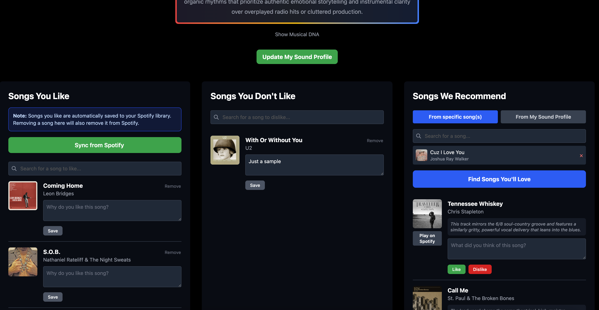

# Songs You Will Love

AI-powered music recommendation engine that learns your unique sound profile and helps you discover songs you'll love.

## 🎵 Why This Project Exists

Spotify doesn't allow indie developers to publish apps on their platform—one of the requirements is having a registered company and at least 250,000 Monthly Active Users. Rather than let this stop me, I decided to open-source the app I built for myself.

This project demonstrates how AI can understand your musical taste beyond simple genre matching, creating a personalized sound profile that captures why you like certain songs and using that understanding to recommend new music.

## ✨ Features

### Core Functionality
- **Spotify Integration**: Login with your Spotify account and sync your liked songs
- **Smart Song Management**: Like or dislike songs with explanations of why
- **AI Sound Profile**: Generate a detailed sound profile based on your musical preferences
- **Musical DNA**: Build a deeper understanding of your taste through song reasons
- **Dual Recommendation Modes**:
  - **Profile-Based**: Get recommendations based on your entire sound profile
  - **Song-Based**: Get recommendations similar to specific songs, filtered through your profile



### AI-Powered Intelligence
- Uses AI (Groq or Google Gemini) to analyze your musical preferences
- Learns from like/dislike patterns and your reasoning
- Generates contextual explanations for each recommendation
- Considers your dislikes to avoid unwanted suggestions

### User Experience
- Real-time song search from Spotify's catalog
- Instant sync with your Spotify liked songs
- Preview songs directly in the app
- Clean, modern interface built with SvelteKit and Tailwind CSS

## 🛠️ Tech Stack

- **Framework**: [SvelteKit](https://kit.svelte.dev/) with Svelte 5 Runes
- **Database**: SQLite with [Drizzle ORM](https://orm.drizzle.team/)
- **AI Providers**: [Groq](https://groq.com/) (fast, free tier) or [Google Gemini](https://ai.google.dev/)
- **Styling**: [Tailwind CSS 4](https://tailwindcss.com/)
- **Auth**: Spotify OAuth 2.0
- **Language**: TypeScript

## 📋 Prerequisites

- Node.js 24.0.0 or higher
- A Spotify developer account
- An API key from either [Groq](https://console.groq.com/) or [Google AI Studio](https://makersuite.google.com/app/apikey)

## 🚀 Setup Instructions

### 1. Clone the Repository

```bash
git clone https://github.com/yourusername/songs-you-will-love.git
cd songs-you-will-love
```

### 2. Install Dependencies

```bash
npm install
```

### 3. Create a Spotify App

1. Go to the [Spotify Developer Dashboard](https://developer.spotify.com/dashboard)
2. Click "Create app"
3. Fill in the details:
   - **App name**: Songs You Will Love (or any name)
   - **App description**: Personal music recommendation app
   - **Redirect URI**: `https://127.0.0.1:5173/login/spotify/callback`
   - **Website**: Use your local URL, you can leave it blank or I actually published it here: https://sywl.fibra.dev/
   - **Which API/SDKs are you planning to use?**: Web API
4. Save and note your **Client ID** and **Client Secret**

### 4. Get an AI Provider API Key

Choose one of the following:

**Option A: Groq (Recommended for speed)**
1. Sign up at [console.groq.com](https://console.groq.com/)
2. Create a new API key
3. Free tier is generous for personal use

**Option B: Google Gemini**
1. Go to [Google AI Studio](https://makersuite.google.com/app/apikey)
2. Create a new API key
3. Free tier available

### 5. Configure Environment Variables

Copy the example environment file:

```bash
cp .env.example .env
```

Edit `.env` with your credentials:

```bash
# Required: Spotify credentials
SPOTIFY_CLIENT_ID=your_spotify_client_id
SPOTIFY_CLIENT_SECRET=your_spotify_client_secret
SPOTIFY_REDIRECT_URI=https://127.0.0.1:5173/login/spotify/callback

# Required: Choose your AI provider (groq or gemini)
AI_PROVIDER=groq
GROQ_API_KEY=your_groq_api_key_here
# OR
GEMINI_API_KEY=your_gemini_api_key_here

# Required: App origin
ORIGIN=https://localhost:5173

# Database (default is fine for local development)
DATABASE_URL=file:local.db
```

### 6. Set Up SSL Certificates (Required for Spotify OAuth)

Spotify requires HTTPS for OAuth. Generate local SSL certificates:

**macOS/Linux:**
```bash
openssl req -x509 -newkey rsa:4096 -keyout localhost-key.pem -out localhost.pem -days 365 -nodes -subj "/CN=localhost"
```

**Windows:**
```powershell
# Install OpenSSL via Chocolatey or download from openssl.org
openssl req -x509 -newkey rsa:4096 -keyout localhost-key.pem -out localhost.pem -days 365 -nodes -subj "/CN=localhost"
```

The certificates should be in your project root directory.

### 7. Initialize the Database

```bash
npm run db:push
```

### 8. Start the Development Server

```bash
npm run dev
```

The app will be available at `https://localhost:5173` (note the HTTPS).

**Note**: Your browser will warn about the self-signed certificate—this is expected. Click "Advanced" and proceed to the site.

## 📖 Usage

1. **Login**: Click "Login with Spotify" and authorize the app
2. **Import Songs**: Click "Sync Spotify Liked Songs" to import your existing liked songs
3. **Add Preferences**: 
   - Search for songs and mark them as liked/disliked
   - Add reasons why you like or dislike songs (this improves recommendations)
4. **Generate Profile**: Once you have some songs with reasons, the app will generate your sound profile
5. **Get Recommendations**:
   - Use "Recommend Songs" for profile-based recommendations
   - Use "Recommend from Songs" and select specific tracks for song-based recommendations
6. **Refine**: Continue liking/disliking and adding reasons to improve your profile

## 🔧 Optional: Advanced Configuration

### OpenTelemetry Observability

The app includes OpenTelemetry instrumentation for traces, metrics, and logs. To enable:

1. Set up an OpenTelemetry collector or use a service like [SigNoz](https://signoz.io/)
2. Add these environment variables:

```bash
OTEL_SERVICE_NAME=sywl
HOST_NAME=your-hostname
OTEL_EXPORTER_OTLP_ENDPOINT=https://your-otel-endpoint
OTEL_LOG_LEVEL=debug
OTEL_TRACES_EXPORTER=otlp
OTEL_NODE_RESOURCE_DETECTORS=env,host,os
```

If not configured, the app works fine without observability—it just won't export telemetry.

## 🏗️ Project Structure

```
songs-you-will-love/
├── src/
│   ├── lib/
│   │   ├── components/       # Svelte components
│   │   └── server/
│   │       ├── ai/           # AI provider implementations
│   │       ├── db/           # Database schema and queries
│   │       ├── spotify.ts    # Spotify API integration
│   │       ├── logger.ts     # Winston logger
│   │       └── tracing.ts    # OpenTelemetry utilities
│   └── routes/               # SvelteKit routes
│       ├── api/              # API endpoints
│       ├── app/              # Main app pages
│       └── login/            # Auth flow
├── drizzle/                  # Database migrations
└── .env                      # Environment variables (not in git)
```

## 🐛 Troubleshooting

### SSL Certificate Issues
- Make sure you're using `https://` not `http://`
- Accept the browser warning for self-signed certificates
- Verify `localhost.pem` and `localhost-key.pem` exist in the project root

### Spotify Redirect URI Mismatch
- Ensure the redirect URI in your `.env` exactly matches what you configured in the Spotify Dashboard
- Must include the full path: `https://127.0.0.1:5173/login/spotify/callback`

### Database Issues
- Delete `local.db` and run `npm run db:push` again to reset the database
- Check that `DATABASE_URL` in `.env` is set correctly

### AI API Issues
- Verify your API key is correct
- Check your API quota/rate limits
- Try switching between Groq and Gemini if one is having issues

## 📝 Available Scripts

```bash
npm run dev          # Start development server (with HTTPS)
npm run build        # Build for production
npm run preview      # Preview production build
npm run check        # Type-check the project
npm run format       # Format code with Prettier
npm run lint         # Lint code with ESLint
npm run db:push      # Push schema changes to database
npm run db:generate  # Generate migrations
npm test             # Run tests
```

## 🤝 Contributing

This is a personal project, but suggestions and improvements are welcome! Feel free to:
- Open issues for bugs or feature requests
- Submit pull requests
- Fork and customize for your own use
